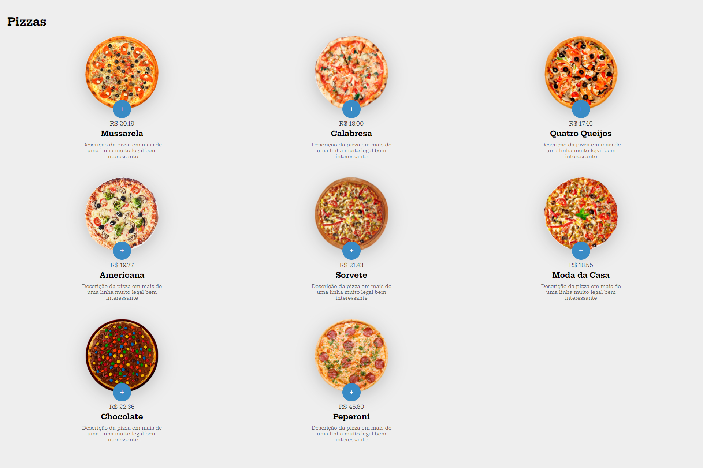
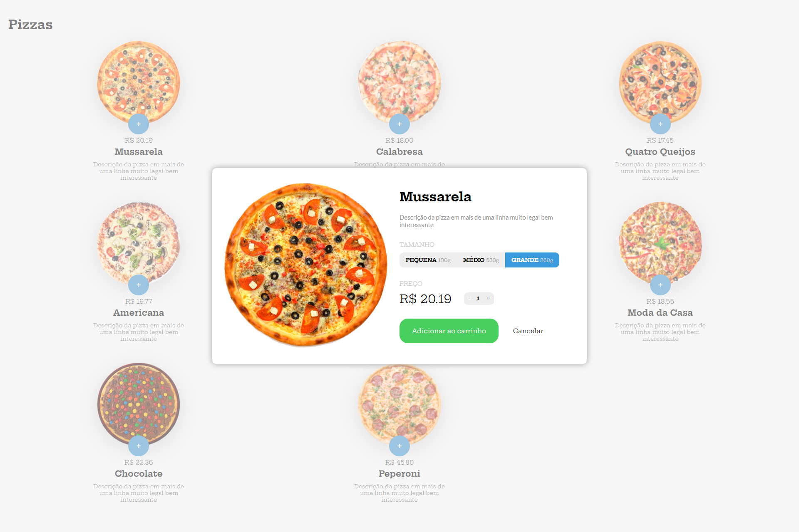

# Projeto - Compra de Pizzas

O projeto consiste em um site e-commerce de pizzaria, criado no intuíto de utilizar meus conhecimentos adquiridos em aula com o Professor Bonieky Lacerda da B7Web. Nele utilizei a stack JavaScript para dar vida ao site existentes, utilizando boa parte de meus conhecimentos, pesquisas e curiosidades.

## Funcionalidades

- Lista de pizzas.
- Descrição e preços dos produtos.
- Carrinho inteligente.
- Site com responsividade.

## Stack utilizada

**Front-end:** HTML5, CSS3, JavaScript

## Documentação

[Documentação no Notion](https://guilhermeoliani.notion.site/Projeto-Compra-de-Pizzas-bface67453b246e489ea89d44571d32c)

## Autores

- [Guilherme Oliani](https://github.com/guilhermenoliani)
- [Bonieky Lacerda](https://www.instagram.com/bonieky/)

## Screenshots

